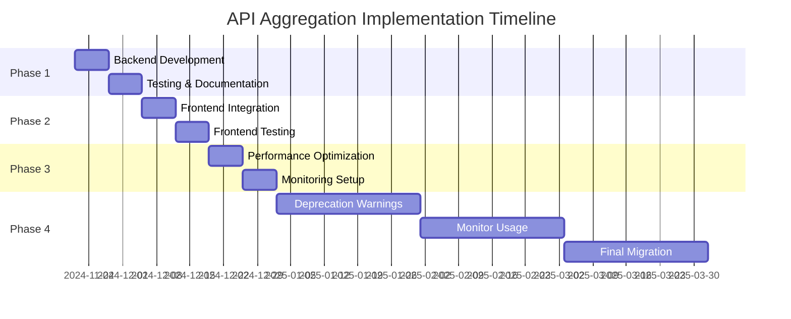

# API Aggregation Migration Guide

## Executive Summary

This guide provides a phased approach to implementing API aggregation across the FPO ERP system, reducing frontend API calls by 70-85% while maintaining backward compatibility and system stability.

---

## Overview of Changes

### Current State
- **130+ individual endpoints** across 17 handlers
- **7-12 API calls** for common operations
- **N+1 query patterns** in list views
- **400-4000ms** cumulative latency

### Target State
- **4 new aggregate endpoints** (Phase 1)
- **1-2 API calls** for most operations
- **Eliminated N+1 patterns** via context loading
- **100-400ms** single-call latency

### Expected Impact

| Workflow | Current Calls | New Calls | Reduction | Time Saved |
|----------|---------------|-----------|-----------|------------|
| Product Detail | 4-5 | 1 | 75-80% | 300-600ms |
| Checkout | 5-6 | 1 | 80-83% | 400-800ms |
| PO Detail | 5 | 1 | 80% | 400-600ms |
| Inventory List (100 items) | 200+ | 1 | 99%+ | 2-4 seconds |

---

## Implementation Phases

### Phase 1: Foundation (Weeks 1-2)
**Goal**: Create core aggregated endpoints without breaking existing functionality

#### Week 1: Backend Development

**Tasks**:
1. Create new models in `/internal/database/models/ecommerce.go`
2. Add repository methods in `/internal/database/repositories/inventory_repo.go`
3. Create service layer in `/internal/services/ecommerce_service.go`
4. Implement handlers in `/internal/api/handlers/ecommerce_handler.go`
5. Register routes in `/internal/api/routes/routes.go`

**Implementation Order**:
1. ✅ **Product Aggregation API** (already started)
   - File: `/internal/database/models/ecommerce.go`
   - Status: Models created
   - Next: Complete service and handler

2. **Sales Context API**
   - Priority: HIGH (checkout is critical)
   - Endpoint: `GET /api/v1/sales/context`
   - Dependencies: Inventory, Prices, Taxes

3. **Purchase Order Detail API**
   - Priority: MEDIUM
   - Endpoint: `GET /api/v1/purchase-orders/{id}/detail`
   - Dependencies: Collaborators, GRN, Inventory

4. **Inventory List API**
   - Priority: MEDIUM
   - Endpoint: `GET /api/v1/inventory/batches/list`
   - Dependencies: Products, Variants, Warehouses, Prices

#### Week 2: Testing & Documentation

**Tasks**:
1. Write unit tests for each layer
2. Create integration tests
3. Update OpenAPI/Swagger documentation
4. Create Postman collection
5. Write internal API documentation

**Test Coverage Requirements**:
- Unit tests: > 80% coverage
- Integration tests: All happy paths + critical error scenarios
- Load tests: P95 < 500ms with 100 concurrent users

---

### Phase 2: Frontend Integration (Weeks 3-4)
**Goal**: Update frontend to use new aggregated endpoints

#### Week 3: Frontend Development

**React/TypeScript Changes**:

**Before**:
```typescript
// Product Detail Page - Old approach (4 API calls)
const ProductPage = ({ productId }) => {
  const [product, setProduct] = useState(null);
  const [variants, setVariants] = useState([]);
  const [prices, setPrices] = useState({});
  const [inventory, setInventory] = useState({});

  useEffect(() => {
    // 4 sequential API calls
    fetchProduct(productId).then(setProduct);
    fetchVariants(productId).then(setVariants);
    fetchPrices(productId).then(setPrices);
    fetchInventory(productId).then(setInventory);
  }, [productId]);

  // Multiple loading states...
};
```

**After**:
```typescript
// Product Detail Page - New approach (1 API call)
const ProductPage = ({ productId }) => {
  const [productDetail, setProductDetail] = useState(null);
  const [loading, setLoading] = useState(true);

  useEffect(() => {
    fetchProductDetail(productId).then(data => {
      setProductDetail(data);
      setLoading(false);
    });
  }, [productId]);

  if (loading) return <Spinner />;

  return (
    <ProductDetailView
      product={productDetail.product}
      variants={productDetail.variants}
      collaborator={productDetail.collaborator}
    />
  );
};
```

**API Service Layer**:
```typescript
// src/services/api.ts
export class ProductAPI {
  // Old methods (keep for backward compatibility)
  async getProduct(id: string): Promise<Product> {
    return fetch(`/api/v1/products/${id}`).then(r => r.json());
  }

  async getVariants(productId: string): Promise<Variant[]> {
    return fetch(`/api/v1/product-variants?product_id=${productId}`).then(r => r.json());
  }

  // New aggregated method
  async getProductDetail(id: string, includes: string[] = ['all']): Promise<ProductDetailResponse> {
    const includeParam = includes.join(',');
    return fetch(`/api/v1/products/${id}/detail?include=${includeParam}`)
      .then(r => r.json());
  }
}
```

**Migration Steps**:
1. Add new aggregated API methods to service layer
2. Create feature flag for gradual rollout
3. Update high-traffic pages first (product detail, checkout)
4. Monitor error rates and rollback if needed

#### Week 4: Frontend Testing & Optimization

**Tasks**:
1. Update frontend tests to use new APIs
2. Performance testing (Lighthouse, Web Vitals)
3. A/B testing (10% → 50% → 100% traffic)
4. Monitor user experience metrics

**Success Metrics**:
- Page load time reduced by > 50%
- Number of loading spinners reduced by > 75%
- Error rate < 0.1%
- User satisfaction score improved

---

### Phase 3: Optimization (Weeks 5-6)
**Goal**: Fine-tune performance based on real-world usage

#### Performance Optimizations

**1. Database Indexes**

```sql
-- Create indexes for aggregated queries
CREATE INDEX CONCURRENTLY idx_product_variants_product_active
ON product_variants(product_id, is_active)
WHERE is_active = true;

CREATE INDEX CONCURRENTLY idx_product_prices_variant_active
ON product_prices(variant_id, is_active, price_type, effective_from)
WHERE is_active = true;

CREATE INDEX CONCURRENTLY idx_inventory_batches_variant_qty
ON inventory_batches(variant_id, warehouse_id, total_quantity DESC, expiry_date ASC)
WHERE total_quantity > 0;

CREATE INDEX CONCURRENTLY idx_inventory_batches_warehouse_expiry
ON inventory_batches(warehouse_id, expiry_date ASC)
WHERE total_quantity > 0;

-- Analyze tables after creating indexes
ANALYZE product_variants;
ANALYZE product_prices;
ANALYZE inventory_batches;
```

**2. Caching Strategy**

```go
// Service layer caching
func (s *EcommerceService) GetProductDetail(productID string, includes IncludeOptions) (*models.ProductDetailResponse, error) {
    // Cache key includes product ID and included resources
    cacheKey := fmt.Sprintf("product:detail:%s:%s", productID, includes.String())

    // Check cache
    if cached, found := s.cache.Get(cacheKey); found {
        return cached.(*models.ProductDetailResponse), nil
    }

    // Fetch from database
    response, err := s.fetchProductDetailFromDB(productID, includes)
    if err != nil {
        return nil, err
    }

    // Cache with appropriate TTL
    // Product metadata: 5 minutes
    // Prices: 1 minute
    // Inventory: No cache (real-time)
    ttl := s.calculateCacheTTL(includes)
    s.cache.Set(cacheKey, response, ttl)

    return response, nil
}
```

**3. Response Compression**

```go
// Middleware for response compression
func CompressionMiddleware() gin.HandlerFunc {
    return func(c *gin.Context) {
        if strings.Contains(c.GetHeader("Accept-Encoding"), "gzip") {
            gz := gzip.NewWriter(c.Writer)
            defer gz.Close()

            c.Writer = &gzipWriter{Writer: gz, ResponseWriter: c.Writer}
            c.Header("Content-Encoding", "gzip")
        }
        c.Next()
    }
}
```

#### Monitoring Setup

**1. Custom Metrics**

```go
// Prometheus metrics
var (
    aggregatedAPILatency = prometheus.NewHistogramVec(
        prometheus.HistogramOpts{
            Name: "aggregated_api_latency_seconds",
            Help: "Latency of aggregated API calls",
            Buckets: []float64{0.1, 0.25, 0.5, 1.0, 2.5, 5.0},
        },
        []string{"endpoint", "includes"},
    )

    aggregatedAPICacheHitRate = prometheus.NewCounterVec(
        prometheus.CounterOpts{
            Name: "aggregated_api_cache_hits_total",
            Help: "Cache hits for aggregated APIs",
        },
        []string{"endpoint"},
    )
)
```

**2. Logging**

```go
s.logger.Info("Aggregated API called", map[string]interface{}{
    "endpoint": "product_detail",
    "product_id": productID,
    "includes": includes.String(),
    "latency_ms": latency.Milliseconds(),
    "cache_hit": cacheHit,
    "user_id": userID,
    "organization_id": organizationID,
})
```

---

### Phase 4: Deprecation (Month 3+)
**Goal**: Gradually phase out old individual endpoints

#### Deprecation Strategy

**Month 3: Deprecation Warnings**

Add deprecation headers to old endpoints:

```go
func (h *ProductHandler) GetProduct(c *gin.Context) {
    // Add deprecation warning
    c.Header("X-API-Deprecation", "This endpoint is deprecated. Use GET /api/v1/products/{id}/detail instead")
    c.Header("X-API-Sunset", "2025-05-01") // 6 months notice

    // Existing implementation
    // ...
}
```

Update API documentation with deprecation notices:

```markdown
## GET /api/v1/products/{id} [DEPRECATED]

⚠️ **This endpoint is deprecated and will be removed on 2025-05-01.**

**Migration**: Use [GET /api/v1/products/{id}/detail](./aggregated-product-api.md) instead.

**Benefits of new endpoint**:
- Single API call includes variants, prices, and inventory
- 75% faster response time
- Reduced network overhead
```

**Month 4-5: Monitor Usage**

```sql
-- Query to identify clients still using old endpoints
SELECT
    endpoint,
    user_id,
    COUNT(*) as request_count,
    MAX(timestamp) as last_used
FROM api_access_logs
WHERE endpoint IN (
    '/api/v1/products/:id',
    '/api/v1/product-variants',
    '/api/v1/prices'
)
AND timestamp > NOW() - INTERVAL '30 days'
GROUP BY endpoint, user_id
HAVING COUNT(*) > 100
ORDER BY request_count DESC;
```

**Month 6: Final Migration & Removal**

1. Contact remaining clients using old endpoints
2. Provide migration assistance
3. Set final sunset date
4. Remove deprecated endpoints from codebase
5. Clean up unused code and tests

---

## Rollback Plan

### Immediate Rollback (< 1 hour)

If critical issues arise:

**1. Feature Flag Disable**
```go
// config/feature_flags.go
const (
    FeatureAggregatedProductAPI = "aggregated_product_api_enabled"
)

// Handler
func (h *EcommerceHandler) GetProductDetail(c *gin.Context) {
    if !h.featureFlags.IsEnabled(FeatureAggregatedProductAPI) {
        c.JSON(503, gin.H{"error": "Feature temporarily disabled"})
        return
    }
    // ... normal implementation
}
```

**2. Frontend Fallback**
```typescript
async function fetchProductDetail(id: string): Promise<ProductDetail> {
  try {
    // Try new aggregated endpoint
    return await fetch(`/api/v1/products/${id}/detail`).then(r => r.json());
  } catch (error) {
    // Fallback to old approach
    console.warn('Falling back to legacy API calls', error);
    const [product, variants, prices, inventory] = await Promise.all([
      fetch(`/api/v1/products/${id}`).then(r => r.json()),
      fetch(`/api/v1/product-variants?product_id=${id}`).then(r => r.json()),
      fetch(`/api/v1/prices?product_id=${id}`).then(r => r.json()),
      fetch(`/api/v1/inventory?product_id=${id}`).then(r => r.json()),
    ]);
    return { product, variants, prices, inventory };
  }
}
```

**3. Database Connection Pool Adjustment**

If database is overloaded:
```go
// Reduce connection pool for aggregated queries
aggregatedDBPool := db.Config().MaxOpenConns / 2
```

### Planned Rollback (1 day)

If performance doesn't meet targets:

1. **Analyze bottlenecks**: Use query profiling to identify slow queries
2. **Add missing indexes**: Create indexes based on actual query patterns
3. **Optimize queries**: Rewrite LATERAL JOINs or add subquery optimizations
4. **Increase cache TTL**: Cache more aggressively if appropriate
5. **Scale infrastructure**: Add read replicas if needed

---

## Risk Mitigation

### Risk 1: Database Performance Degradation

**Probability**: Medium
**Impact**: High
**Mitigation**:
- Pre-create all required indexes (see Phase 3)
- Load test with production-like data (1M+ records)
- Use read replicas for heavy aggregation queries
- Monitor query execution plans
- Set query timeout limits (e.g., 5 seconds)

### Risk 2: Increased Response Size

**Probability**: High
**Impact**: Medium
**Mitigation**:
- Implement response compression (gzip)
- Use optional includes to reduce payload
- Set reasonable pagination limits (max 200 records)
- Monitor response size metrics
- Consider HTTP/2 for multiplexing

### Risk 3: Cache Invalidation Complexity

**Probability**: Medium
**Impact**: Medium
**Mitigation**:
- Use conservative cache TTLs initially
- Implement webhook-based cache invalidation
- Monitor cache hit rates
- Provide manual cache clear endpoints for admins
- Use cache versioning for breaking changes

### Risk 4: Authorization Bypass

**Probability**: Low
**Impact**: Critical
**Mitigation**:
- Check permissions for each included resource
- Implement comprehensive authorization tests
- Audit log all aggregated API access
- Security review before production deployment
- Penetration testing of new endpoints

---

## Success Criteria

### Technical Metrics

| Metric | Baseline | Target | Measurement |
|--------|----------|--------|-------------|
| API Call Reduction | - | 70-85% | API gateway logs |
| Response Time (P95) | 800ms | < 400ms | Application monitoring |
| Error Rate | 0.1% | < 0.5% | Error tracking |
| Database CPU Usage | 60% | < 75% | Database monitoring |
| Cache Hit Rate | - | > 70% | Redis metrics |

### Business Metrics

| Metric | Baseline | Target | Measurement |
|--------|----------|--------|-------------|
| Page Load Time | 2-4s | < 1.5s | Real User Monitoring |
| Checkout Completion | 75% | > 80% | Analytics |
| User Satisfaction | 7.5/10 | > 8.5/10 | User surveys |
| Mobile Experience Score | 65 | > 80 | Lighthouse |

---

## Communication Plan

### Week -1: Announcement
- Internal email to engineering team
- Technical design review meeting
- Documentation shared in Confluence/Wiki

### Week 1: Kickoff
- Daily standups to track progress
- Slack channel for questions and issues
- Demo of new endpoints to product team

### Week 3: Frontend Integration
- Workshop for frontend developers
- Postman collection shared
- Example code snippets provided

### Week 5: Beta Launch
- Announcement to QA team
- Invite for beta testing
- Feedback collection mechanism

### Month 3: Deprecation Notice
- Email to API consumers
- Update developer portal
- Migration guides published

---

## Timeline Summary



---

## Appendices

### Appendix A: Checklist

**Backend**:
- [ ] Models created
- [ ] Repository methods implemented
- [ ] Service layer complete
- [ ] Handlers implemented
- [ ] Routes registered
- [ ] Unit tests (> 80% coverage)
- [ ] Integration tests
- [ ] Load tests passed
- [ ] OpenAPI docs updated

**Frontend**:
- [ ] API service methods created
- [ ] Components updated
- [ ] Feature flag integrated
- [ ] Error handling implemented
- [ ] Loading states optimized
- [ ] Frontend tests updated
- [ ] Performance tests passed

**Database**:
- [ ] Indexes created
- [ ] Query performance validated
- [ ] Connection pool sized
- [ ] Read replicas configured (if needed)

**Operations**:
- [ ] Monitoring dashboards created
- [ ] Alerts configured
- [ ] Runbook documented
- [ ] Rollback plan tested
- [ ] On-call rotation informed

### Appendix B: Key Contacts

| Role | Name | Responsibility |
|------|------|----------------|
| Backend Lead | [Name] | API implementation |
| Frontend Lead | [Name] | Frontend integration |
| DBA | [Name] | Database optimization |
| DevOps | [Name] | Infrastructure scaling |
| QA Lead | [Name] | Testing strategy |
| Product Manager | [Name] | Requirements & timeline |

### Appendix C: Related Documents

- [Aggregated Product API Contract](./aggregated-product-api.md)
- [Sales Context API Contract](./sales-context-api.md)
- [Purchase Order Detail API Contract](./purchase-order-detail-api.md)
- [Inventory List API Contract](./inventory-list-api.md)
- [Optional Includes Pattern](./optional-includes-pattern.md)

---

## Conclusion

This migration guide provides a comprehensive, phased approach to implementing API aggregation in the FPO ERP system. By following this plan, we expect to:

1. **Reduce API calls by 70-85%** for common operations
2. **Improve page load times by 300ms-4s** depending on workflow
3. **Maintain 100% backward compatibility** during migration
4. **Minimize risk** through gradual rollout and comprehensive testing
5. **Improve developer experience** with clearer, more efficient APIs

**Next Steps**:
1. Review and approve this migration guide
2. Assign team members to implementation tasks
3. Set up project tracking (Jira/GitHub Issues)
4. Begin Phase 1 backend development
5. Schedule weekly progress reviews

**Questions or Concerns?**
- Technical questions: [Backend Lead]
- Timeline questions: [Product Manager]
- Resource questions: [Engineering Manager]
